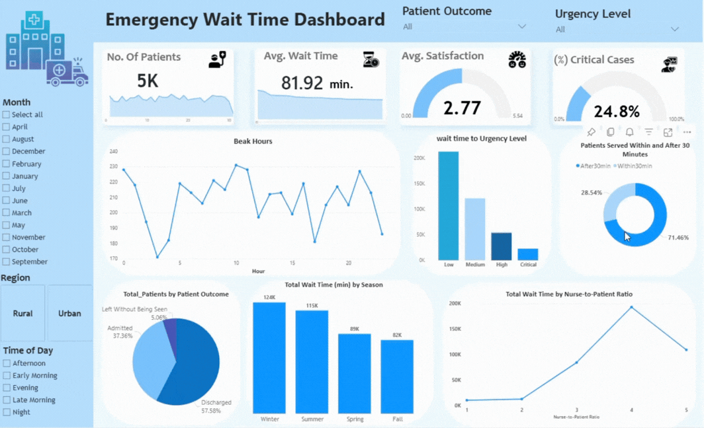

# 🏥 Emergency Wait time Analysis & Performance Dashboard

## 📌 Overview

This project presents an **end-to-end data analysis** of hospital operations, focusing on patient flow, waiting times, and staff availability. The objective is to uncover key factors contributing to overcrowding and provide actionable insights to improve healthcare efficiency and patient experience.

---

## 🎯 Objectives

* Analyze patient journey from registration to medical consultation
* Identify **bottlenecks** causing delays
* Evaluate the impact of **staff availability (doctors & nurses)**
* Measure hospital performance using key KPIs

---

## 📊 Dataset Description

The dataset includes detailed hospital visit records with features such as:

* Patient & Visit Information
* Time metrics (Registration, Triage, Medical Attention, Total Wait Time)
* Staff metrics (Specialist Availability, Nurse-to-Patient Ratio)
* Operational data (Hospital, Region, Facility Size)
* Patient-related metrics (Outcome, Satisfaction, Urgency Level)
* Time features (Hour, Day, Month, Season)

---

## 🧹 Data Preparation

* Data cleaning and preprocessing
* Handling missing values (simulated where necessary)
* Feature engineering to enhance analysis

### 🔧 Engineered Features

* **Staff Load Index**
* **Wait Time Categories**
* **Patients Served Within 30 Minutes (%)**
* **Critical Cases (%)**

---

## 📈 Exploratory Data Analysis (EDA)

Key analyses performed:

* Peak hours and patient distribution
* Wait time trends across different time periods
* Relationship between staff availability and delays
* Impact of urgency level on waiting time
* Correlation between wait time and patient satisfaction

---

## 📊 Dashboard (Power BI)

An interactive dashboard was developed to visualize key insights.

### 🔝 KPIs

* Total Patients
* Average Wait Time
* Average Satisfaction
* Critical Cases (%)
* Patients Served Within 30 Minutes (%)

---

## 💡 Key Insights

* More than **70% of patients experience long waiting times**, indicating significant operational delays.
* The **average patient satisfaction score is 2.77**, reflecting a generally low level of satisfaction.
* There is a strong negative relationship between **waiting time and patient satisfaction** — longer waits lead to lower satisfaction.
* Despite higher staff availability, **waiting times tend to increase**, suggesting potential inefficiencies in staff utilization.
* **Critical patients receive faster medical attention**, indicating effective prioritization in emergency cases.
* Waiting times are noticeably higher during the **evening hours**, highlighting peak demand periods.

---

## 🛠️ Tools & Technologies

* **Python** (Pandas, NumPy, Matplotlib)
* **Power BI** (Dashboard & DAX Measures)
* Data Cleaning & Feature Engineering
* Data Visualization

---

## 🤝 Acknowledgment

This project was developed as part of a data analysis assessment, demonstrating end-to-end analytical and visualization skills.

Data link from kaggle: https://www.kaggle.com/datasets/rivalytics/er-wait-time

---

## ⭐ Don't forget to star the repo if you found it useful!
